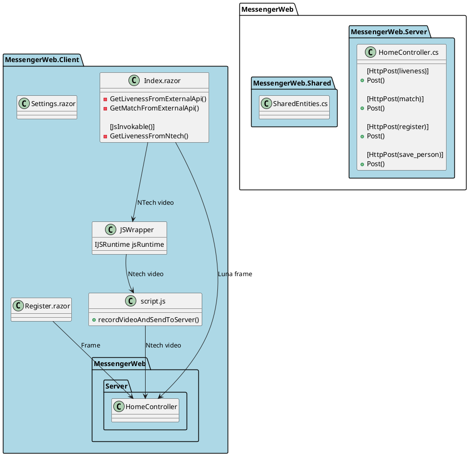

#IBTP MessengerWeb Client

##1. Структура решения:
Blazor Webassembly ASP .Net Core 5 hosted приложение. Состоит из трех проектов:
- MessengerWeb.Client
Blazor WASM проект, содержащий верстку в razor страницах, набор UI сервисов, сервиса Http запросов в серверную часть, и набор javascript функций для взаимодействия с элементом <'video />, захвата кадров и видео
- MessengerWeb.Server
ASP .Net Core проект. Здесь находятся методы контроллеров, ожидающие запросы от клиентского приложения
- MessengerWeb.Shared
Библиотека классов, инкапсулирующая сущности и модели, используемые в обоих проектах.

##2. Структура программного обеспечения:
Ниже представлена верхнеуровневая диаграмма проектов, razor-страниц, классов и сервисов приложения.

##3. Используемые технологии
В проекте использованы технологии Webassembly (Blazor), Javascript ASP.Net Core 5. При запуске MessengerWeb.Server приложение готово отдавать UI в браузер в виде .net runtime, dll и файлов js в браузер, и обмениваться данными с серверной частью.

##4. UI
Клиентское приложение - это SPA с тремя основными компонентами:
- /
- /register
- /settings

Корневой маршрут (располагается в Index.razor) - это страница, осуществляющая матчинг и liveness из видеопотока. Использует роуты /Home/liveness и /Home/match в серверном приложении.
Маршрут /register (Register.razor) - осуществляет регистрацию лица. Использует роуты /Home/register и /Home/save в серверном приложении.
Маршрут /settings (Settings.razor) позволяет выбрать движок и хранит его в памяти во время использования приложения.

Для стриминга видео, захвата фото и видеоматериала используется набор функций из файла /wwwroot/scripts.js.
####Для Luna:
Из файла Index.razor с попомщью JsInterop вызываются функции Snap и GetImageData, возвращают в Index.razor байты, и отправляются HttpCient'ом в серверную часть.
####Для NTech:
Вследствие того, что движок NTech ожидает видеоматериал, с помощью JsInterop вызывается функция record(). После снятия видеоматериала прямо из js runtime осуществляется post запрос в серверную часть, т.к. здесь не имеет смысла гонять такие большие объемы информации между рантаймами. При возврате ответа вызывается коллбэк `dotNetGlobal.DotNetReference.invokeMethod('GetLivenessFromNtech', this.responseText);`, и агрументом возвращает в Index.razor результат liveness.

##5. Серверная часть

Это классическое ASP.Net core приложение с API для взаимодействия с клиентским приложением. Имеет БД SQLite и EF Core ORM для сохранения UUID обрабатываемой персоны из external api. Вместе с UUID в таблице также хранистя доп. информация (ФИО и должность). Сохраняет эти данные из клиентской формы с помощью метода контроллера /save, и возвращает эти данные из БД при успешном матчинге в методе контроллера /match.

Содержит вспомогательный сервис ApiRequestsService.cs с объектом HttpClient для обмена данными с external api, маршруты для которого вынесены в appsettings.json.

##6. Сборка и запуск

`dotnet publish '.\src\Server\MessengerWeb.Server.csproj' -o \MessengerWeb_publish_linux --runtime linux-x64 --self-contained true`

На выходе получится исполняемый файл ELF и набор dll, готовый для запуска под linux.